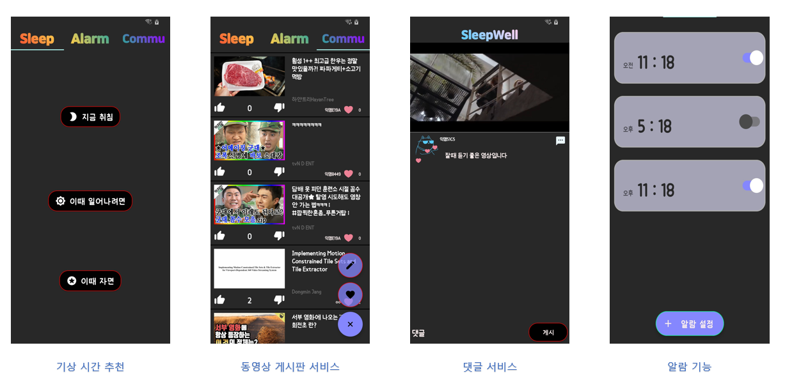

# Sleepwell for Android
Android App

### Sleepwell Contributors

---

이재석 (Android): krgeo@naver.com

이윤석 (Server): gktgnjftm@naver.com

## Introduction
---
수면을 효율적으로 하기 위해 제작된 간편한 앱으로서, 현재 자는 시간을 기준으로 최적의 기상 시간을 알려줍니다. 그리고, 알람 기능과 수면유도를 위한 동영상 시청 서비스를 제공하고 있습니다.



### 앱 설치

--- 

<a href="https://play.google.com/store/apps/details?id=practice.kotlin.com.sleepwell" target="_blank">클릭하고 앱 다운로드 하기</a>

### 사용 기술
---
* Android
*  Kotlin
*  RESTApi
*  Retrofit2
*  Gradle
*  Room 
*  YouTube Android Player API

### Development Environment
---
* IntelliJ IDEA 2020
* mysql @8.0.0


### Application Version

---

| SDK |Version|
|:---:|:---:|
|`minSdkVersion `|21|
|`targetSdkVersion `|29|
  

<br>

### DataBase Diagram

---


### License
---
for jellytogglebutton
```
Copyright 2016 Nightonke

Licensed under the Apache License, Version 2.0 (the "License");
you may not use this file except in compliance with the License.
You may obtain a copy of the License at

   http://www.apache.org/licenses/LICENSE-2.0

Unless required by applicable law or agreed to in writing, software
distributed under the License is distributed on an "AS IS" BASIS,
WITHOUT WARRANTIES OR CONDITIONS OF ANY KIND, either express or implied.
See the License for the specific language governing permissions and
limitations under the License.
```